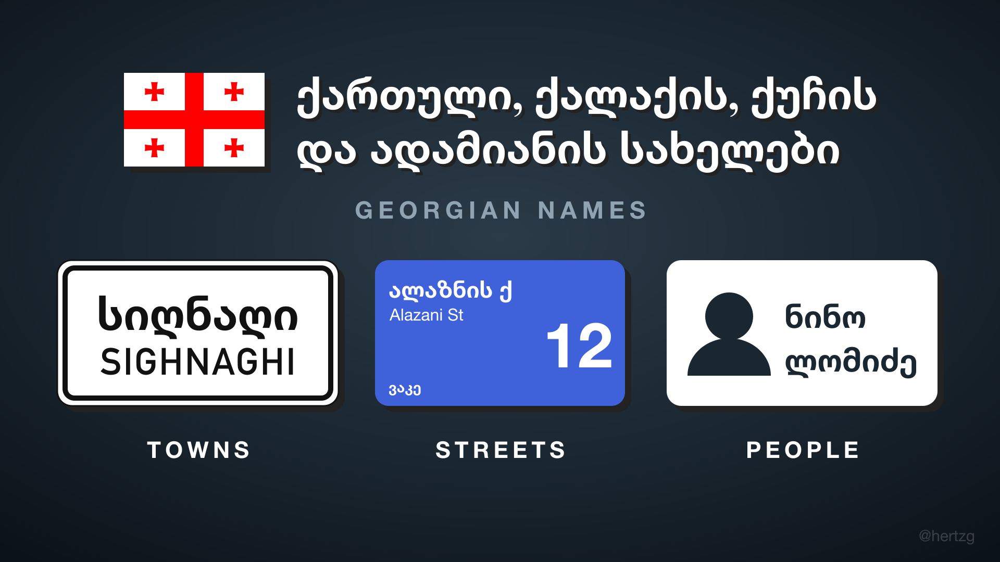

# Georgian Language Pack (ქართული)

A Transport Fever 3 mod that plays the game in Georgian: about 2,400 game texts
translated, a font that can draw Georgian letters, and a name set with real
Georgian towns, villages, Tbilisi streets and Georgian people.



## Turn it on

1. Mod Hub: subscribe to the mod.
2. Settings > Language: pick "ქართული (Georgian)".
3. ახალი თამაში > მოდების დამატება (New Game > Add Mods): add the mod.
4. ახალი თამაში > სახელები (New Game > Names): pick "Georgian (ქართული)".

Step 2 is needed even for the names alone: the game's own font has no Georgian
letters.

## Help with the translation

შეცდომა იპოვეთ ან უკეთესი სიტყვა იცით? დაწერეთ Issue ან გამოგზავნეთ Pull Request.

- **Report a string:** open a [Translation issue](../../issues/new?template=translation.yml)
  with a screenshot of where you saw it, the text shown, and what it should say.
- **Fix a string:** edit the matching entry in `translations/*.json` and send a
  pull request. Each entry is the game's English text and its Georgian:

  ```json
  {"msgid": "New Game", "msgstr": "ახალი თამაში"}
  ```

  Entries can also carry `msgctxt` (same English, different meaning) and
  `msgid_plural`; `tools/build_strings.py` explains each shape.
- **Word choice:** plain modern Georgian, no Russian loanwords where a Georgian
  word exists. Check doubtful terms with `python3 tools/ka_dict.py <word>`
  (National Parliamentary Library dictionaries).

## Layout

```
hertzg_georgian_names/        the mod, as the game loads it
├── _metadata/                mod page text and cover (0.png)
├── content/locale/           language definition and fonts
├── content/names/            the Georgian name set
└── strings/en/LC_MESSAGES/   built game text (base.mo), don't edit by hand
translations/*.json           Georgian strings, the source for base.mo
tools/
├── build_strings.py          translations → base.mo
├── preview.lua               print sample names without the game
├── ka_dict.py                dictionary lookup
├── merge_fonts.py            builds Georgian Names Sans (Lato + Noto Georgian)
└── cover.svg                 cover source
```

## Build

```sh
# game text, after editing translations/*.json (needs gettext)
python3 tools/build_strings.py "<TF3 install>/base/strings/en/LC_MESSAGES/base.mo"

# sample names
lua tools/preview.lua 25

# cover
rsvg-convert -w 1920 -h 1080 tools/cover.svg -o hertzg_georgian_names/_metadata/0.png
```

To try your changes in the game, link `hertzg_georgian_names/` into the game's
`staging_area` folder (next to `settings.lua` in the game's user data).

## License

MIT (see `LICENSE`) for the code, translations and name lists. The fonts in
`hertzg_georgian_names/content/locale/` keep their own SIL Open Font License;
the license files sit next to them.
